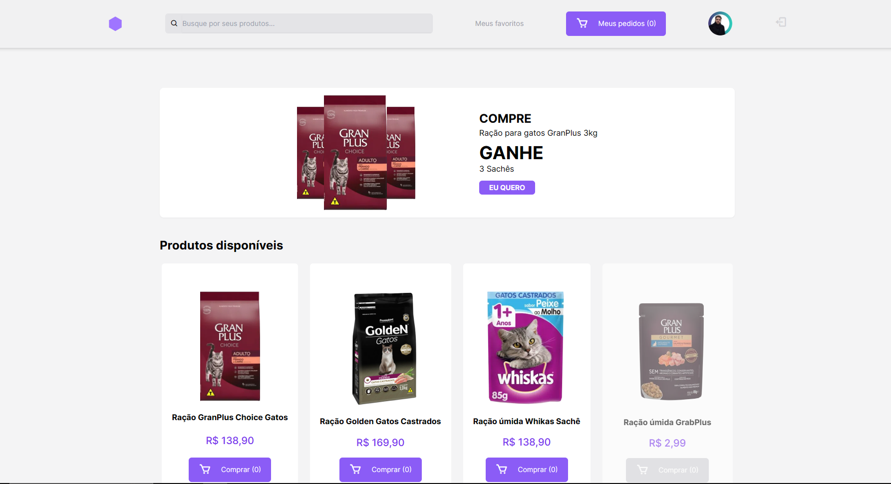

# Petshop X

Construção de uma aplicação web de um petshop contendo serviços de venda de produtos e de serviços para animais de pequeno e grande porte.
Esta aplicação deve ser possível realizar a busca e visualização dos produtos e serviços disponíveis cadastro de pet, cadastro de usuário e login no sistema. O sistema web deve atender os requisitos mínimos de qualidade de um sistema, atributos como usabilidade, funcionalidades, confiabilidade, eficiência e uma fácil manutenção devem estar presentes.
O projeto foi desenvolvido utilizando `HTML`, `Javascript` e `TailwindCSS`.

No projeto, foram implementadas várias funções com o propósito de demonstrar todas as páginas criadas. Por exemplo, temos a função `redirectToRandomPage()`, que realiza um sorteio aleatório para redirecionar o usuário para a página de carrinho, com ou sem produtos, mostrando assim os diferentes estados da aplicação.

No arquivo `cart.js`, as funções presentes simulam o incremento fictício de itens no carrinho, visando apenas a demonstração do conceito. Para tornar essa funcionalidade útil, é recomendado armazenar o array de produtos adicionados nos cookies ou no armazenamento local do usuário.

No `user.js`, a função disponível permite a troca da imagem de perfil do usuário. Essa funcionalidade é implementada apenas para fins de demonstração de funcionamento, visto que seria necessário termos um database para armazenar as informações.

No arquivo `pet.js`, são encontradas funções e listeners que permitem alternar a seleção de cards de pets, além de ativar botões e formulários na página.

A geração dos elementos HTML dos cards de pets é tratada pela função `renderizarPetCard()` no arquivo `createPetCard.js`. Essa função possibilita a criação de vários cards a partir de um array de objetos, possibilitando a manipulação destes dados de maneira mais dinâmica.

Para os detalhes do produto, a abordagem utiliza parâmetros de consulta na URL. Por exemplo, ao utilizar a URL `href="./pages/product.html?id=product4"`, o arquivo `productGeneratePage.js` captura os parâmetros de consulta e, com eles, percorre o objeto de produtos. A partir daí, os detalhes do produto são dinamicamente renderizados em tela. Isto aplica conceitos parecidos com o de uma SPA (single page application)

Para a criaçaõ de usuário, fiz o uso do onSubmit do usuário e criei validações de dados com o auxilio da função `submitRegisterForm()`, esta função, simula uma conexão com um banco de dados, por isso o motivo do setTimeOut e do array de usuários. Mostra o toast de notificação quando o usuário preenche todos os dados corretamente.


<p align="center">
  
</p>


## Tabela de Conteúdos

- [Estrutura de Pasta](#estrutura-de-pastas)
- [To-Do](#to-do)
- [Tecnologias Utilizadas](#tecnologias-utilizadas)
- [Como Usar](#como-usar)
- [Adicionando novos pets](#adicionando-novos-pets)
- [Adicionando novos produtos](#adicionando-novos-produtos)
- [Autor](#autor)

## Estrutura de Pasta
1. **./assets**: Esta pasta contém recursos necessários para o desenvolvimento da aplicação.

   - **./assets/images**: Aqui estão todas as imagens usadas no site, como fotos de produtos, ícones, logotipos etc.
   - **./assets/js**: Esta pasta armazena arquivos JavaScript.

2. **./pages**: Aqui estão as páginas HTML.

   - **pages/loginForm.html**: Página destinada para realizar o login na aplicação.
   - **./pages/register.html**: Página destinada ao registro de um usuário no sistema.
   - **./pages/cart.html**: Página do carrinho de compras, onde os produtos selecionados pelos usuários podem ser exibidos.
   - **./pages/emptyCart.html**: Página do carrinho de compras, porém quando não tiver nenhum item adicionado.
   - **./pages/product.html/id=product**: Página do produto, para utiliza-lá é necessário passar um QUERY PARAMETERS na rota.
   - **./pages/myFavorites.html**: Página de produtos favoritados pelo usuário.
   - **./pages/user/profile.html**: Página contento o perfil do usuário, contento o histórico de compras dele.
   - **./pages/user/editProfile.html**: Página em que o usuário pode modificar algumas informações.
   - **./pages/user/myPets.html**: Página contento informações dos pets adicionados pelo usuário.

3. **./index.html**: Este é o arquivo principal (página inicial) do site. É a primeira página que os visitantes verão quando acessarem o site.

4. **README.md**: Este é um arquivo de markdown criado para fornecer informações sobre o projeto.

## To-do
- [x] Página Home
- [x] Página de login
- [x] Página de registro
- [x] Página de Produtos
- [x] Página de Carrinho
- [x] Página de Carrinho Vazio
- [x] Página de Produtos favoritos
- [x] Página de meus pets
- [x] Página de perfil do usuário
- [x] Página de edição de dados do usuário 

## Tecnologias e Ferramentas Utilizadas

- **FIGMA**: Ferramenta utilizada para criação de layouts.
- **HTML**: Linguagem de marcação de hyper text.
- **Tailwind CSS**: Um framework CSS utilitário que acelera o processo de estilização e torna as interfaces responsivas.
- **Box icons**: Pacote de ícones utilizado no projeto.
- **Toastify-js**: Biblioteca javascript para adicionar toast notifications à página.


## Como Usar

1. Clone o repositório para o seu ambiente local:

```bash
git clone https://github.com/RenanFachin/PUC_PetShopX.git
```

2. Acesse a aplicação em seu navegador a partir do arquivo index.html

## Simulando login na aplicação
Para criar uma simulação de um case real, foi criado um array contendo alguns usuários previamente cadastrados:

```js
  const users = [
    {username: "user1", password: 'password'},
    {username: "user2", password: 'password'},
  ]
```

Caso sejam informados username e passwords contidos em users, o sistema retornara uma mensagem de login efetuado com sucesso, caso contrário, será um alerta de erro.

## Criando usuário
Na página /pages/register.html, será possível verificar como seria a criação de usuário, o form consta com campos de tipo text, date, email, checkbox.
Para que fosse possível fazer a simulação, existe uma função que verifica a consistência dos dados, adiciona à um array de usuários e simula uma conexão de 4000ms com o banco de dados. Neste tempo de 4000ms o formulário fica desabilitado para evitar uma multiplos submits.


## Adicionando novos pets
No arquivo `createPetCard.js` possuímos um array contendo objetos que representam os pets, com as seguintes propriedades.

```js
  {
    nome: 'Apolo',
    raça: 'SRC',
    petImage: '../../assets/images/Pet1.jpeg',
    dataDeNascimento: 'xx/xx/xxx',
    apelidos: 'Apoquico, Abolinha, Apolinho',
    porte: 'Pequeno',
    ultimaConsulta: 'xx/xx/xxx',
  },
```

Para adicionar um novo pet basta criar um novo objeto e adicionar as propriedades listadas acima e então, ao fazer o reload da tela, teremos os cards do total de pets presente neste array criado na tela.

## Adicionando novos produtos
No arquivo `productGeneratePage.js` possuímos um objeto contendo as propriedades de um produto.
Conforme modelo abaixo.

```js
const productsData = {
  'product1': {
    produto: 'Ração GranPlus Choice Gatos',
    preco: '138,90',
    precoSemDesconto: '269,90',
    avaliacoes: '120',
    status: 'Em estoque',
    imagemProduto: '../assets/images/racao1.png',
    tamanhos: '10.1kg',
    tipoRacao: 'Premium Especial',
    indicadoPara: 'Todas as Raças',
    indicadoParaPorte: 'Filhote, Adulto, Sênior',
    produtoSimilar1: '../assets/images/ração-seca-2.png',
    produtoSimilar2: '../assets/images/racao-umida-1.png',
    produtoSimilar3: '../assets/images/racao-umida-2.png',
    redirectProdutoSimilar2: 'id=product2',
    redirectProdutoSimilar3: 'id=product3',
    redirectProdutoSimilar4: 'id=product4',
  }
}
```

Para adicionar um novo produto basta criar um novo objeto e adicionar as propriedades listadas acima e então, é só acessar `pages/product.html/id=NOMEDONOVOOBJETO`

## Autor
- [Renan Fachin](https://github.com/RenanFachin/)